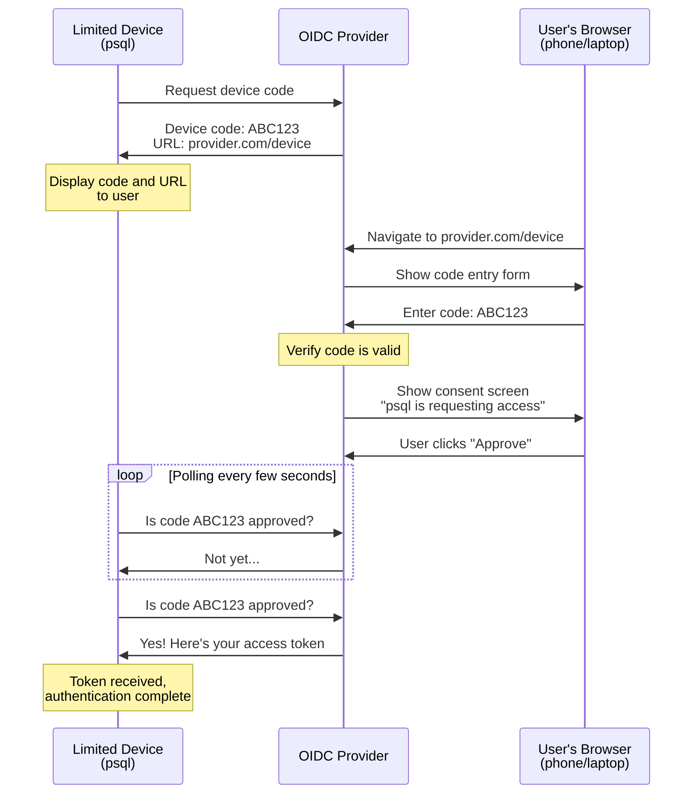

```mermaid
sequenceDiagram
    participant Device as Limited Device<br/>(psql)
    participant Provider as OIDC Provider
    participant Browser as User's Browser<br/>(phone/laptop)

    Device->>Provider: Request device code
    Provider->>Device: Device code: ABC123<br/>URL: provider.com/device

    Note over Device: Display code and URL<br/>to user

    Browser->>Provider: Navigate to provider.com/device
    Provider->>Browser: Show code entry form
    Browser->>Provider: Enter code: ABC123

    Note over Provider: Verify code is valid

    Provider->>Browser: Show consent screen<br/>"psql is requesting access"
    Browser->>Provider: User clicks "Approve"

    loop Polling every few seconds
        Device->>Provider: Is code ABC123 approved?
        Provider->>Device: Not yet...
    end

    Device->>Provider: Is code ABC123 approved?
    Provider->>Device: Yes! Here's your access token

    Note over Device: Token received,<br/>authentication complete
```
