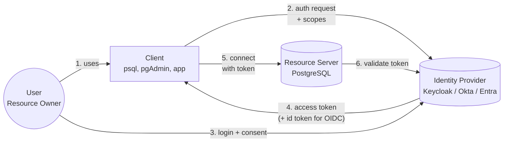
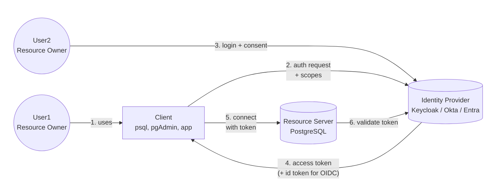

### Don’t OIDC yourself in the foot

Postgres 18’s New OAuth Explained

<hr>
<p>Zsolt Parragi · <a href="mailto:zsolt.parragi@percona.com">zsolt.parragi@percona.com</a></p>
<p style="font-size: 0.7em;">PGConf.DE · April 22nd, 2026 · Essen, Germany</p>

---

## Who am I?

* **Zsolt Parragi** · Software Engineer at Percona
  * Joined Percona as a software developer in 2017 and has been working on Percona’s database products ever since 
  * Initially focusing on MySQL and later switching to PostgreSQL
  * Likes to focus on things that make life easier and safer: encryption, authentication, extensibility, testing, and tooling.
  * Author of pg_oidc_validator

---
### Agenda

* OIDC? Security? Convenience?
* PostgreSQL and (validator) plugins
* Minimal OIDC setup with PostgreSQL
* Questions?

--
### Sorry for the long explanation...

* I hope it's not boring
* OAuth is an easy to use feature
* It is difficult to use correctly
* Avoiding the "Let's simplify it for the demo" mentality
  * Ignoring security concerns for a security feature


---
### From the PostgreSQL perspective
* New in PostgreSQL 18
* Improved in PostgreSQL 19
* More improvements expected in PostgreSQL 20+
* Requires server side support (plugins)
  * pg_oidc_validator
  * others?
* Requires client side support
  * Libraries
  * Applications
  * Libpq plugins (19+)


---
### OAuth or OIDC?
* OAuth
  * Grants "permissions" to apps without sharing passwords
  * "What can you do?"
  * Gives an access token
* OIDC
  * Introduces the concept of "identity" on top of OAuth
  * "Who are you?"
  * Gives an identity token


--
### Which is better for us?
OAuth

If a user can supply an OAuth access token with the "pg-admin" scope, assign the admin role

OIDC

If a user can log in with this provider, look up their role in pg_ident.conf based on their email address


--
### OIDC: for security!
* Centralized user control
* Risk reduction with short lived tokens
* Enforced security standards (password policy, MFA, ...)
* Open standard, no vendor lock-in

--
### OIDC: for convenience!
* SSO, "Login with Google/Okta/..."
* Click next, next, next, no need for passwords!
* Implicit trust
* Provider/workflow omissions
* Do I have to keep tokens / codes safe?

---

### Client types

* OAuth clients have an id and a secret (password)
* Confidential clients: can store secrets securely
* Public clients: everything is visible for everyone

--

### Authentication flows

* Authorization code flow for server-client applications
* Authorization code flow with PKCE for single page / desktop applications
* Client credentials flow for application-application communication
* Device Authorization Grant for limited devices (smart tvs, printers, psql...)

--

### PostgreSQL is a ...

1. Confidential client
2. A public client with web authentication
3. A limited device public client
4. None of the above

--

## PostgreSQL is a resource server

* It is not a client at all
* OAuth flow/authentication is up to the software using it
* Receives the access token after the OAuth flow completed

--

## The clients

* psql
* pgAdmin
* A Django/Rails/... traditional web application
* A desktop application using libpq
* ...

---

## Public and device clients

* The "password" is public
* Any other software can impersonate it
* Users have to verify: am I logging in where I want to?
* Device flow is even worse
  * One "device" logging in
  * Another device allowing it
  * Can be even on two different continents...

--

### The participants



--

### The problem



--

### The dangers of laziness

* Security requires explicit consent
* Don't skip consent screens
* Never use generic scopes
* Educate users

--

### Scopes?

<div style="display: flex; align-items: center; gap: 2rem;">
<div style="flex: 1;">


</div>
<div style="flex: 1; text-align: left;">

* A permission label
* PostgreSQL doesn't rely on the client ID
* It relies on the scope

</div>
</div>

--

### Can we make it better?

* The "password" is public
* There are some possible improvements
  * PKCE
  * DPoP
  * ...
* These are improvements, not magic fixes
* Not supported by PostgreSQL 18
* Test and verify your providers!

---

### From the PostgreSQL perspective
* New in PostgreSQL 18
* Improved in PostgreSQL 19
* More improvements expected in PostgreSQL 20+
* **Requires server side support (plugins)**
  * pg_oidc_validator
  * others?
* **Requires client side support**
  * Libraries
  * Applications
  * Libpq plugins (19+)

--

### Requires client side support

* Web app?
* Desktop client?
* Console locally?
* Console over SSH?
* Python script connecting automatically?
* Database viewer for smart TVs?


--

### Requires server side support

* OAuth/OIDC is a collection of standards
* Leaves many details to implementations
* Some identity providers clearly deviate from the RFCs
* Access tokens
  * JWT for many providers
  * Opaque for some
  * Proprietary introspection APIs vs signature verification
* Identity mapping
  * Sub claim is configurable for many providers
  * For others its always a random generated UUID

-- 

### Minimal setup

pg_hba:

```
host all all 127.0.0.1/32 oauth issuer=issuer_url scope=pgserver1
                                   validator=pg_oidc_validator map=oa
```

pg_ident:

```
# MAPNAME SYSTEM-USERNAME DATABASE-USERNAME
oa foo bar
```

postgresql.conf:

```
oauth_validator_libraries =pg_oidc_validator
```

Connecting:

```
psql -h 127.0.0.1 'dbname=postgres oauth_issuer=issuer_url oauth_client_id=pgclient'
```

-- 

### Multiple providers?

pg_hba:

```
host all all 127.0.0.1/32 oauth issuer=issuer1_url scope=pgserver1
host all all 127.0.0.1/32 oauth issuer=issuer2_url scope=pgserver1
```

postgresql.conf:

```
oauth_validator_libraries=pg_oidc_validator
```

Connecting:

```
psql -h 127.0.0.1 'dbname=postgres oauth_issuer=issuer2_url oauth_client_id=pgclient'
```

--

### Debugging

PG18:

```
PGOAUTHDEBUG=UNSAFE
psql -h 127.0.0.1 'dbname=postgres oauth_issuer=issuer_url oauth_client_id=pgclient'
```

PG19+:

```
PGOAUTHDEBUG=UNSAFE:trace
psql -h 127.0.0.1 'dbname=postgres oauth_issuer=issuer_url oauth_client_id=pgclient'
```

--

### Fine control?

* Common infrastructure is for login / role assignment
* Validators can assign custom database roles directly
* Nothing prevents validators to be extensions
* Exposing OAuth claims (scope, sub, client) as variables


---

### Demo

* Docker environment available at:
  https://github.com/percona/pg_oidc_validator/tree/main/examples/keycloak

* OIDC blog posts at
  https://percona.community/tags/oidc/

--- 

# Questions?

### Find me after the talk or online:

**zsolt.parragi@percona.com**

*Slides: [https://dutow.github.io/slides/pgconf-de-2026-oidc/](https://dutow.github.io/pgconf-de-2026-oidc/)*

---
<br> April 21-22 in Essen, Germany

